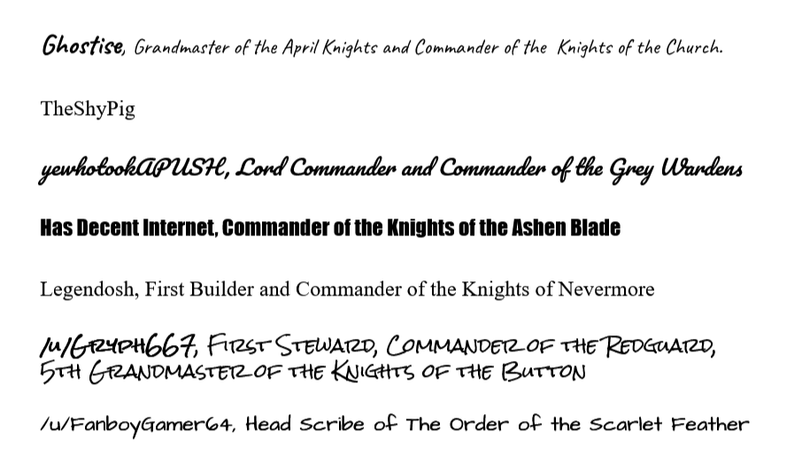

[Bill number: 6-301]: #
[Author: Ghostise]: #
[Proposed Date: 4/11/2018]: #
[Passed Date: 12/18/2018]: #

I, Ghostise, acting in full power of my command as Grandmaster of the April Knights, ordain this charter for the April Knights.

Our Order was founded in the days of the Button as a force of balance and a beacon of hope. We strive to spread the glory of our Order far and wide, to unite the people of Reddit towards a common goal, and to oppose the evil forces of chaos that seek to ruin the fun of the April Events.

## Article 1

### Section 1
1. The position of Grandmaster is the chief executive and is voted in by the consent of our order by a popular vote.
2. The Grandmaster shall serve a term lasting from the moment they are sworn in until the next April event is finished.
3. To be eligible to run for Grandmaster, a candidate must be both a battalion commander and have participated in two full campaigns.

### Section 2
1. The Grandmaster is supreme commander of all Knight forces and has full power to exert their authority over all operations.
2. The Grandmaster has full authority to declare war and negotiate all treaties during times of both peace and war.
3. The Grandmaster has the power to veto all legislation either council passes. Both Councils have the power to bypass a veto with two thirds of both councils voting in favor of the legislation.
4. The Grandmaster has the power to introduce legislation. All legislation must pass both councils with an absolute majority and be deemed constitutional by the Council.
5. All proposed legislation has to have the ability to be viewed by the public for 2 weeks before voting.

### Section 3
1. The Grandmaster shall have the power to change their Upper Council every three months with the consent of the Lower Council via a vote.

### Section 4
1. The Grandmaster has the authority to raise battalions, either new or through reinstatement, with authorisation from the Upper Council.
2. The Grandmaster has the power to nominate candidates for commanders of any battalions he raises; new appointments are confirmed by a majority of the Upper Council.

## Article 2

### Section 1
1. The Upper Council shall consist of seven additional members to the Grandmaster, the First Ranger, the First Steward, the First Builder, the Grand Inquisitor, the Necromancer and two advisors, all appointed by the Grandmaster.
2. All legislation must be voted on by the Upper Council by a simple majority of at least five of the eight Upper Council members agreeing.
3. After passing in the Upper Council, it must also pass the Lower Council and be voted on by the battalion Commanders.

### Section 2
1. The Upper Council has the power to introduce legislation. All legislation introduced must be approved by both Councils and approved by the Grandmaster.
2. All proposed legislation must have the ability to be viewed by the public for 2 weeks before voting.
3. If legislation needs to be passed during an April Event, Section 2.2 can be waived.

## Article 3

### Section 1
1. Each battalion commander will be a member of the Lower Council and is entitled to one vote.
2. The Lower Council has the power to introduce legislation. All legislation that passes the Lower Council must be deemed constitutional by the Upper Council and approved by the Grandmaster.
3. If the battalion commander has obligations in the Upper Council, the battalions First Officer will take their Commanders place in the Lower Council.

## Article 4

### Section 1
1. Should the Grandmaster be guilty of a crime, the Councils have the ability to impeach them.
2. Impeachment cannot be based off of any actions taken by the Grandmaster while Article 5 was active.
3. Impeachment proceedings are identical to the proceedings described in Section 2 on the exception that the tribunal panel consists of all Commanders and Councilors.
4. During the Grandmaster’s impeachment proceedings all power given to the grandmaster is transferred to an interim Grandmaster decided upon by a simple majority vote of both Councils.
5. Consensus of the panel is decided upon via a two thirds majority vote.

### Section 2
1. The general process of impeachment for any officer with the rank of Commander or higher (referred to as an officer in point two and below). The Grandmaster or a majority vote of either Council can also appoint/impeach officers with a rank lower than commander.
2. Should an impeachment of an officer be called for by a member of either Council, a tribunal will be held to determine whether the accused is guilty or not.
3. The tribunal panel will consist of 5 members of the lower and/or Upper Council decided amongst themselves based off of who would be the most impartial to the case.
4. During the proceedings, both the accuser and the accused will have an opportunity to present their case in that order. The tribunal panel will then be free to ask questions to either party or an outside one in order to ascertain any information needed.
5. Once both parties have pleaded their case and the panel has decided they have no more need for information, the panel will then come to a consensus based off of how they see fit. The panel is not only responsible for determining if the officer is impeached or not, but if the accusations warrant a punishment less severe than impeachment. Should the officer in question be impeached, the panel is also responsible for deciding said officer’s standing with the April Knights.
6. Should the accused be inactive, the Grandmaster or a member of either Council should take adequate measures to ensure the accused is informed of their trial. The accused, however, is not required to attend the proceedings should they choose not to.

### Section 3
1. All other crimes committed by any other sworn Knight shall be decided through a tribunal.
2. Three Commanders are randomly selected to act as judges of the accused. These Commanders must be impartial and if any of the randomly selected have any conflict of interest that would affect their judgement they are to be cast aside and another is randomly selected.
3. The accused has the right for a fellow sworn Knight to speak on their behalf.
4. The judges come up with a verdict and bring their recommendation to the Grandmaster, who then decides upon the conviction and punishment.

## Article 5

### Section 1
1. Both Councils have the power to grant emergency powers to the Grandmaster, suspending their authority.
2. Invoking Article 5 must be approved by two thirds of both Councils.
3. The duration of Article 5 must be specified when being enacted.
4. An early revocation of Article 5 proposed by a body other than the Grandmaster must be approved by two thirds of both Councils.
5. Article 5 cannot last more than 6 months after it is passed by the Councils.

### Section 2
1. The Grandmaster shall be granted absolute power for the duration of Article 5.
2. The Grandmaster shall have immunity for the duration of Article 5 and shall have immunity for all actions during.
3. The Grandmaster cannot use the mentioned absolute power to extend the duration of Article 5.

### Section 3
1. The Grandmaster has the power to countermand Article 5 at any time against the both Councils wishes.
2. Should this occur, a two thirds vote of both Councils can give specific temporary powers, never absolute power, to an individual that is not the Grandmaster. The Councils cannot bestow these powers without the Grandmaster’s rejection of Article 5 being enacted at that time.

## Article 6

### Section 1
1. The Councils have the power to propose amendments to this constitution. The amendment must be ratified through a two thirds majority in both Councils to be added to this constitution.

## Signatures

Ghostise, Grandmaster of the April Knights and Commander of the  Knights of the Church.

TheShyPig

yewhotookAPUSH, Lord Commander and Commander of the Grey Wardens

Has Decent Internet, Commander of the Knights of the Ashen Blade

Legendosh, First Builder and Commander of the Knights of Nevermore

/u/Gryph667, First Steward, Commander of the Redguard, 5th Grandmaster of the Knights of the Button

/u/FanboyGamer64, Head Scribe of The Order of the Scarlet Feather
